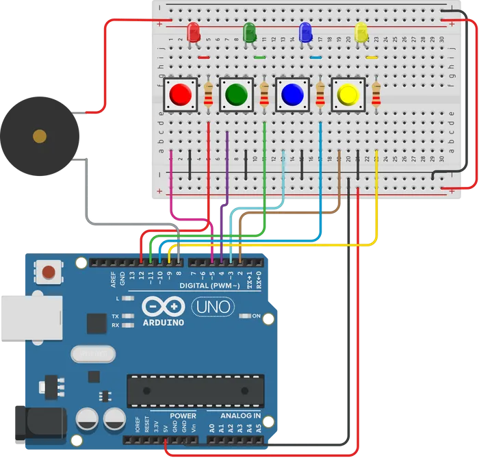

# SIMON
## Introduction
Simon is a popular electronic game that was designed to test a player's memory and sequencing skills. 
The game was designed by [Ralph Baer](https://en.wikipedia.org/wiki/Ralph_H._Baer) who is known as The Father of the Video Game. Baer was an inventor, known for his many contributions to games and helping to spark the video game industry.

Simon was released in 1978. The game was so popular that after 4 years of it’s release more than 10 million copies of Simon had been sold. It is pretty simple to play the game. Turn on the device and pay attention as the four buttons light up randomly and make different sounds. You have to memorize the pattern and then press the buttons in the same order to move onto the next level. As you progress through the levels, the number of buttons to press will increase, making the game more challenging. Simon is a game that can improve your cognitive abilities, allowing players to work on their memory, attention, and focus.

So how do we make our own Simon game?
 
## Items
First we will need the following items: 
- [Arduino Uno](https://www.amazon.com/Arduino-A000066-ARDUINO-UNO-R3/dp/B008GRTSV6/ref=sr_1_2_sspa?crid=1PL226LFF50IJ&keywords=arduino+uno&qid=1683939963&sprefix=arduino+uno%2Caps%2C110&sr=8-2-spons&psc=1&smid=AA57DDZKZUZDL&spLa=ZW5jcnlwdGVkUXVhbGlmaWVyPUFaMFdUWDFZQ0ExV0kmZW5jcnlwdGVkSWQ9QTAzMDg1MjIyV1ZNV0RDSVlQVzU0JmVuY3J5cHRlZEFkSWQ9QTA5NDYzMzdOV0RGVklGUERMS1Emd2lkZ2V0TmFtZT1zcF9hdGYmYWN0aW9uPWNsaWNrUmVkaXJlY3QmZG9Ob3RMb2dDbGljaz10cnVl)
- [6x Push Buttons](https://www.amazon.com/TWTADE-Yellow-Orange-6x6x5mm-Tactile/dp/B07C7211PJ/ref=sr_1_11?crid=2EO4HGJF0AS69&keywords=Push+Buttons&qid=1683940103&sprefix=push+buttons%2Caps%2C438&sr=8-11)
- [4x LED (Green, Red, Yellow, Blue)](https://www.amazon.com/DiCUNO-450pcs-Colors-Emitting-Assorted/dp/B073QMYKDM/ref=sr_1_3?crid=L0GF9ZIR52FE&keywords=LED+%28Green%2C+Red%2C+Yellow%2C+Blue&qid=1683940137&sprefix=led+green%2C+red%2C+yellow%2C+blue%2Caps%2C107&sr=8-3)
- [4x Resistor (220Ω)](https://www.amazon.com/Resistor-Tolerance-Resistors-Limiting-Certificated/dp/B08QRFCMC9/ref=sr_1_2_sspa?keywords=220+ohm+resistor&qid=1683940317&sprefix=220+%2Caps%2C150&sr=8-2-spons&psc=1&spLa=ZW5jcnlwdGVkUXVhbGlmaWVyPUEzMUtJSzdCT1VMUTFWJmVuY3J5cHRlZElkPUEwNDc1NjM0MUdZREpXRkZVWTNUOCZlbmNyeXB0ZWRBZElkPUEwNTM3MTQxMjZOWE1aRkNIMFgzVSZ3aWRnZXROYW1lPXNwX2F0ZiZhY3Rpb249Y2xpY2tSZWRpcmVjdCZkb05vdExvZ0NsaWNrPXRydWU=)
- [Piezo Buzzer](https://www.amazon.com/Cylewet-Terminals-Electronic-Electromagnetic-Impedance/dp/B01NCOXB2Q/ref=sr_1_6?crid=290LNTAKL584&keywords=Piezo+Buzzer&qid=1683940347&sprefix=piezo+buzzer%2Caps%2C113&sr=8-6)

## Pin Assignments
All pins are in excel sheet in the assemble_simon folder. 

This is a small circuit diagram of our project

## Demo
- [Link to Youtube Video](https://youtu.be/sWAvEqo8YO8)

## Credit
You can also find the code and the project on [goodarduinocode.com](https://goodarduinocode.com/projects/simon)

